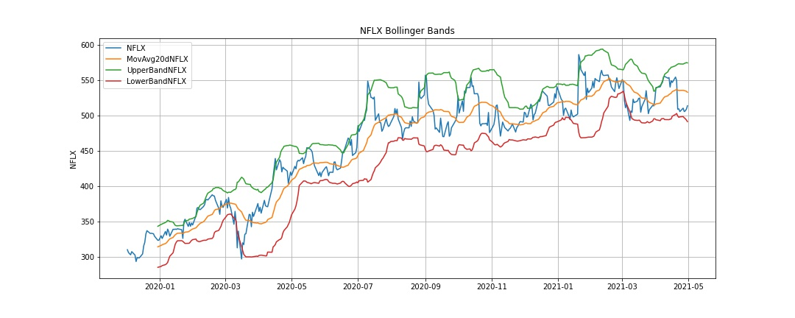
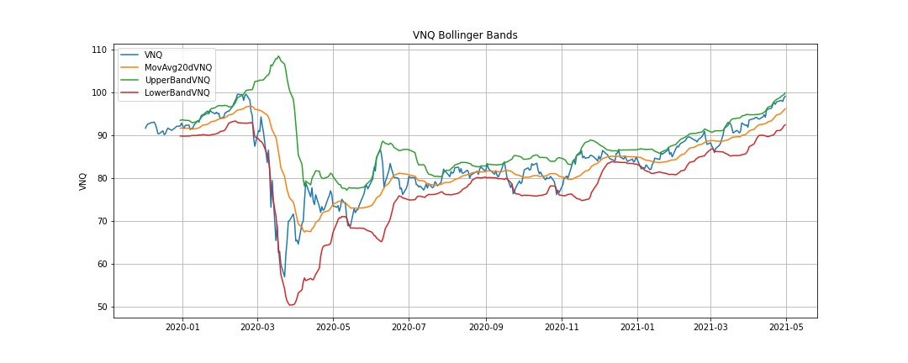
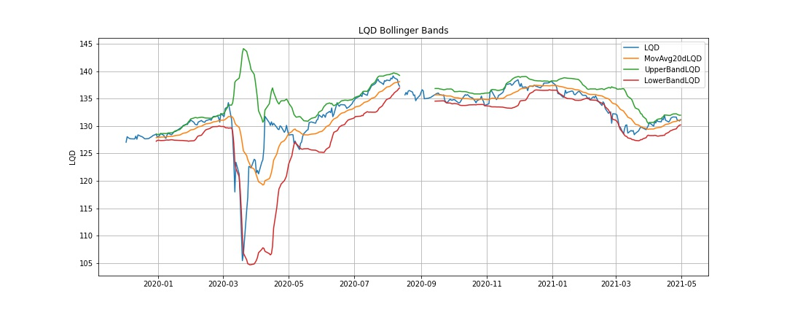
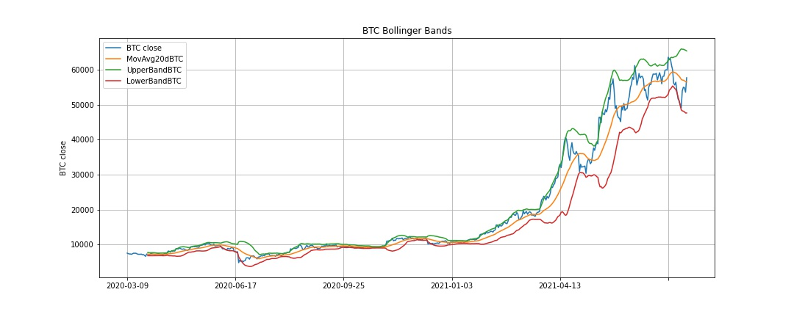

# **Bollinger Bands**

## *What is Bollinger Bands?*
A Bollinger Band is a technical analysis tool defined by a set of trendlines plotted two standard deviations (positively and negatively) away from a Simple Moving Average of a security's price, but which can be adjusted to user preferences.
### Three lines compose Bollinger Bands:
- Middle Band: Simple Moving Average
- Upper Band: Simple Moving Average + 2 Standard Deviations
- Lower Band: Simple Moving Average - 2 Standard Deviations
### They developed and copyrighted by technical trader John Bollinger, with the goal to discover opportunities that give investors a higher probability of properly identifying when an asset is oversold or overbought.

## *What does it have to do with our project?*
### The questions we are trying to answer: 
1. How well does the Bollinger Bands work in different asset type?
2. What are the characteristics for the asset type that work well and vice versa?

---

## Data Processing
We were able to utilize the Alpaca API to pull data from single name stock and ETFs for the duration (1.5 year). 

`etfs = alpaca.get_barset(tickers, timeframe, start = start_date, end = end_date, limit = 1000).df`

However, the Alpaca API doesn't have the same infomration for crypto. Luckily, Alpha Vantage has API for pullig crypto prices. 

`btc_url = "https://www.alphavantage.co/query?function=DIGITAL_CURRENCY_DAILY&symbol=BTC&market=USD&apikey=" + api_key`

`btc_data = requests.get(btc_url).json()`

`btc_df = pd.DataFrame.from_dict(btc_data['Time Series (Digital Currency Daily)'], orient='index')`

`btc_df.dropna(inplace=True)
btc_df.rename(columns={
    '4a. close (USD)':'BTC close',
}, inplace=True)
btc_df = btc_df[['BTC close']]
btc_df.sort_index(inplace=True)`

Overall, data is accessible and clean. We did some basic data quality check such as checking for na or null. 

---

## Analysis
### Single Name Stock - Microsoft, Netflix, MasterCard, Exxon, and Disney
 

### ETFs - iShares Core US Aggregate Bond, SPDR S&P 500, US Natural Gas Fund, Vanguard Real Estate Index Fund, iShares Investmet Grade Corporate Bond
 

### Crypto - Bitcoin, Dogecoin, Ethereum, Chainlink, IoT Chain
 

## Beta as mesaure of volitality
insert table

## % of data that's out side the bands in each asset type
insert table

## Correlation b/w beta and outside band %?
insert graph

---

## Conclusion
insert conclusion

# Pending Items to be addressed
1. use a libary that is not covered in class

