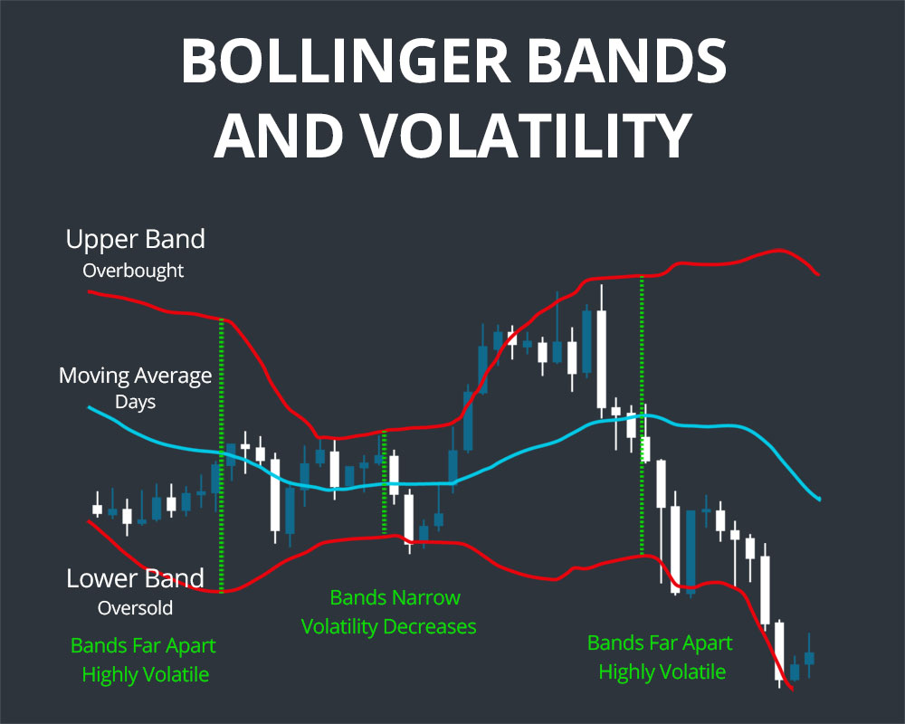
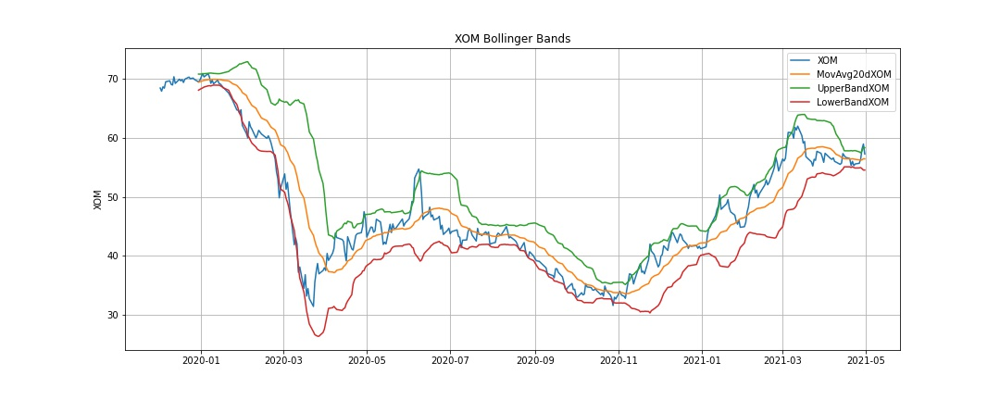
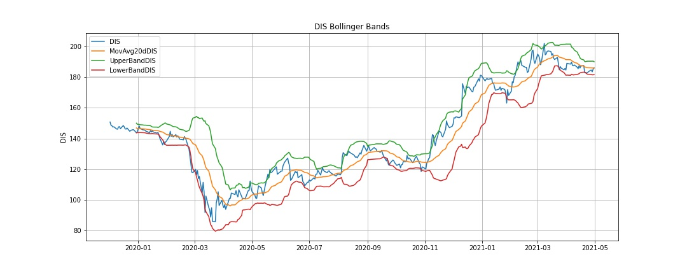
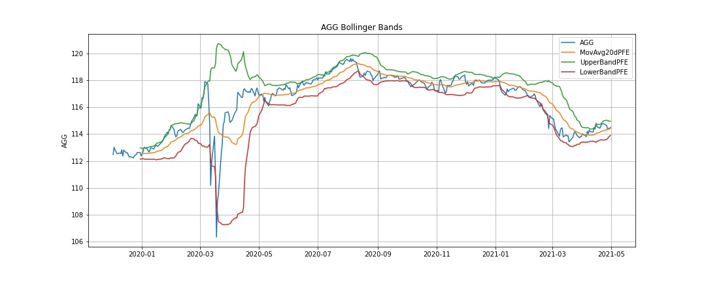

# **Bollinger Bands**

## *What is Bollinger Bands?*
A Bollinger Band is a technical analysis tool defined by a set of trendlines plotted two standard deviations (positively and negatively) away from a Simple Moving Average of a security's price, but which can be adjusted to user preferences.
### Three lines compose Bollinger Bands:
- Middle Band: Simple Moving Average
- Upper Band: Simple Moving Average + 2 Standard Deviations
- Lower Band: Simple Moving Average - 2 Standard Deviations
### They developed and copyrighted by technical trader John Bollinger, with the goal to discover opportunities that give investors a higher probability of properly identifying when an asset is oversold or overbought.

## *What does it have to do with our project?*
### The questions we are trying to answer: 
1. How well does the Bollinger Bands work in different asset type?
2. What are the characteristics for the asset type that work well and vice versa?

---

## Data Processing
We were able to utilize the Alpaca API to pull data from single name stock and ETFs for the duration (1.5 year). 

`etfs = alpaca.get_barset(tickers, timeframe, start = start_date, end = end_date, limit = 1000).df`

However, the Alpaca API doesn't have the same infomration for crypto. The workaround for that is google and yahoo finance. We either used the formula in google sheet to pull the data or just downloaded the date from yahoo finance and save them as csv. This workaround required a little bit more work to put all the crypto data together. 

`ada_path = Path("crypto_data/ADA.csv")`

`ada = pd.read_csv(ada_path, index_col='Date', parse_dates=True, infer_datetime_format=True)`

`crypto = pd.concat([ada, btc_close, dog, eth, xrp_close], axis = "columns", join = "inner")`

Overall, data is very accessible and clean. We check did some basic data quality check such as checking for na or null. 

---

## Analysis
### Single Name Stock - Microsoft, Netflix, MasterCard, Exxon, and Disney
 

### ETFs - iShares Core US Aggregate Bond, SPDR S&P 500, US Natural Gas Fund, Vanguard Real Estate Index Fund, iShares Investmet Grade Corporate Bond
 

### Crypto - 

## Beta as mesaure of volitality
insert beta for each asset type

## % of data that's out side the bands in each asset type
insert data

## Reason for why it works or doesn't work for certain type of asset class. calculating the beta for each assets as volitility measure. 
insert explanation

## Conclusion
insert conclusion

# Pending Items to be addressed
1. use a libary that is not covered in class
2. update graphs to hvplot()
3. possible another indicator such as EMA?
